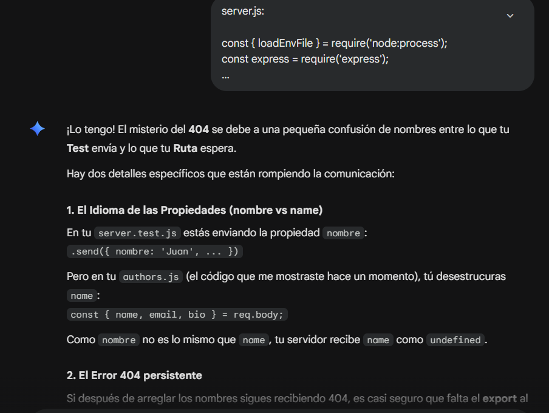
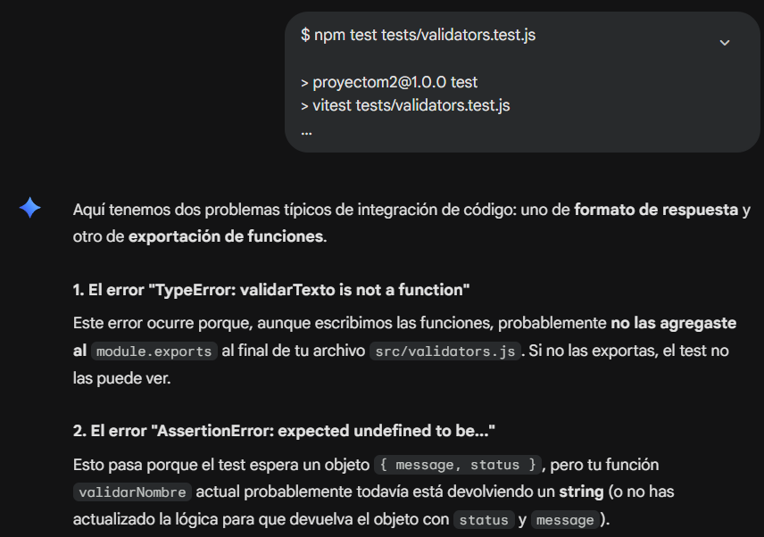
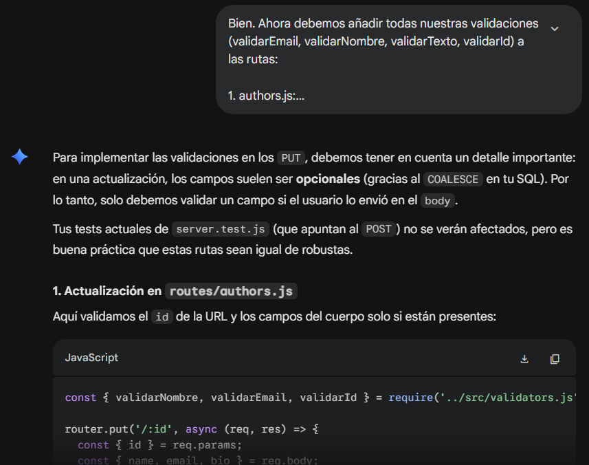

Este archivo no contiene texto generado por IA.

En este proyecto se usó exclusivamente Gemini.
El uso de IA en este proyecto fue fundamental para hacer barridos completos a lo largo de todo el repositorio.
En momentos habían conceptos que no entendía o que añadía al proyecto solo porque las lectures lo mencionaban, lo cual obviamente generaba problemas y errores. La IA fue fundamental para arreglar estos errores, tanto como para enseñarme estos conceptos de manera práctica, que para mi es mucho más fácil de entender.
Sin su ayuda, me hubiera rendido por la cantidad inmensa de información.

---

## Prompts

Siempre se le dejaron dos cosas claras a la IA: su tarea, el contexto y, en ocasiones, lo que no debe hacer, en caso de que fuera necesario. Sin embargo, como casi todo se hizo dentro de una misma conversación, cuando estabamos resolviendo un problema ella ya tenía bastante contexto y yo solo iba enviandole pedazos de código o logs de error de la consola. Cuando eso era resuelto, avanzabamos al siguiente problema.

En el siguiente ejemplo podemos ver como le envié pedazos del código de server.js y server.test.js lo cual fue suficiente contexto para que resolviera mi problema:

<small>se puede ver como copiar y pegar código fue suficiente contexto.</small>

---

### Debugging

Muchas veces, ya que los mismos logs de error en la consola proveen el contexto, como por ejemplo, en qué archivo hay un error, o en vitest, que dice exactamente el archivo con la línea donde ocurrió el error, la IA misma encuentra el contexto que necesita en base a lo que el mismo error provee. En este ejemplo se puede ver como simplemente dandole a la IA lo que salía en Bash, esta pudo encontrar el problema y darme una solución. Obviamente si fuera una conversación nueva, sería necesario darle más contexto.

---

### Escribiendo código

Está claro que la IA es la obrera. Aquí un ejemplo, una vez ya tenía listas mis validaciones, le pedí a la IA que los agregara a mis rutas. Esto no solo salva tiempo, sino que, como antes de implementar rutas usaba un sistema diferente, se evita código repetido, errores de typing, etc.

---

En un ambiente de aprendizaje como este, la IA es vital para alguien como yo que aprende haciendo, no leyendo. El paso al que uno debe aprender en Henry es mucho para mi capacidad de comprensión lectora y de retención de información. Al ir de la mano de la IA, puedo aprender haciendo, cometiendo errores, viendo videos y siempre tendré ese apoyo con respuesta a todo sin necesidad de hacer un trabajo de arqueología buscando información en una documentación o video de youtube, o buscando manualmente un problema difícil de encontrar dentro del proyecto.